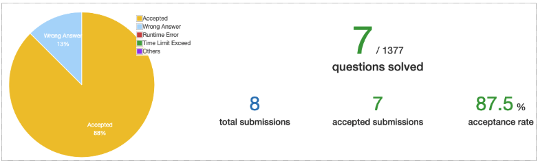

# 数组 (array)

逻辑结构：线性结构。   
存储结构：顺序存储。     

## 题型 

一维数组 : 一维数组从数据结构角度来看好像没啥好学的，实际上是为了学习一些操作一维数组的套路。比如 ：滑窗、双指针等。 有些一维数组的题目暴力解一般都要 O(n^2)，但一般能用这些套路来优化，以降低时间复杂度。

多维数组 : 一般是二维数组题多一点，出题时常会用于表示矩阵、平面直角坐标系。多层循环嵌套难以避免，所以时间复杂度相对高。 

## 进度 

这里通过率之所以这么高，是因为我一般都是用另一个 session 做题。只是要求查看每周进度，所以把做好的题顺便放到新的 session 再提交一遍，并截图进度。 

## 题解  

| # | 笔记  | 难度 |    
|---|---|---|    
| 128  | [Longest Consecutive Sequence][q128] | 困难 | 
| 1222 | [Queens That Can Attack the King][q1222] | 中等 | 
| 1252 | [Cells with Odd Values in a Matrix][q1252] | 简单 | 
| 1266 | [Minimum Time Visiting All Points][q1266] | 简单 |   
| 1299 | [Replace Elements with Greatest Element on Right Side][q1299] | 简单 |    
| 1304 | [Find N Unique Integers Sum up to Zero][q1304] | 简单 | 
| 1351 | [Count Negative Numbers in a Sorted Matrix][q1351] | 简单 |   

<!-- refs -->
[q128]:https://github.com/chenxinlong/leetcode/blob/master/algs/128.go#L61~L93 
[q1222]:https://github.com/chenxinlong/leetcode/blob/master/algs/1222.go 
[q1252]:https://github.com/chenxinlong/leetcode/blob/master/algs/1252.go 
[q1266]:https://github.com/chenxinlong/leetcode/blob/master/algs/1266.go 
[q1299]:https://github.com/chenxinlong/leetcode/blob/master/algs/1299.go 
[q1304]:https://github.com/chenxinlong/leetcode/blob/master/algs/1304.go 
[q1351]:https://github.com/chenxinlong/leetcode/blob/master/algs/1351.go 