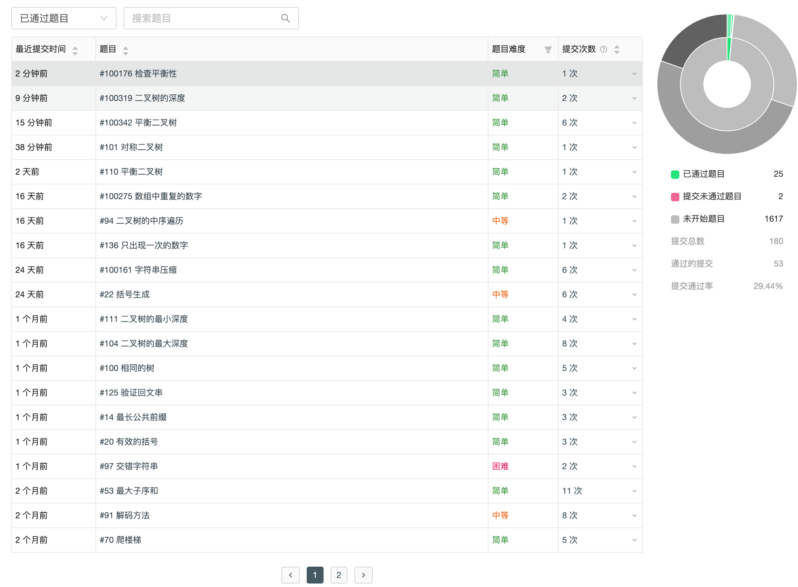

# `leetcode` 算法历程

## [数组](./week1-array)

1. [两数之和](./week1-array/两数之和.md)
2. [三数之和](./week1-array/三数之和.md)
3. [删除排序数组中的重复项](./week1-array/删除排序数组中的重复项.md)
4. [下一个排列](./week1-array/下一个排列.md)

## [动态规划](./week2-dynamic)

1. [最长回文子串](./week2-dynamic/最长回文子串.md)
1. [爬楼梯](./week2-dynamic/爬楼梯.md)

