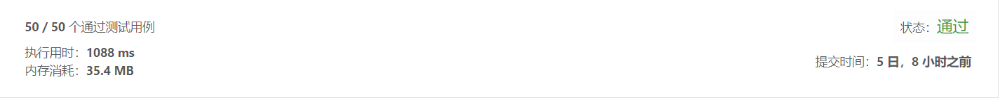
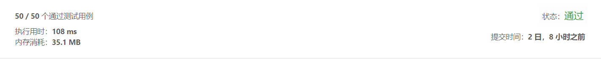

## 盛最多水的容器

> 给你 n 个非负整数 a1，a2，...，an，每个数代表坐标中的一个点 (i, ai) 。
> 在坐标内画 n 条垂直线，垂直线 i 的两个端点分别为 (i, ai) 和 (i, 0)。
> 找出其中的两条线，使得它们与 x 轴共同构成的容器可以容纳最多的水。
> 说明：你不能倾斜容器，且 n 的值至少为 2。

示例1:
输入：[1,8,6,2,5,4,8,3,7]
输出：49


-解法1
  - 解题思路    
    暴力循环，循环没两个柱子之间的面积，找出最大面积

-代码
```
	/**
	 * @param {number[]} height
	 * @return {number}
	 */
	var maxArea = function(height) {
		if(height === null) return 0 
		if(height.length < 2) return 0
		var maxValue = 0
		for(var i = 1;i<height.length;i++){
			var ai = height[i]
			for(var j = 0;j<i;j++){
				var aj = height[j]
				var area
				if(ai >= aj){
					area = (i - j)*aj
				}else{
					area = (i - j)*ai
				}
				if(area > maxValue){
					maxValue = area
				}
			}
		}
		return maxValue
	}; 
```  
- 测试结果

    
-算法分析
    - 时间复杂度: `O(n2)`
    - 空间复杂度: `O(1)`
    - 逻辑复杂度: `O(1)`

-解法2**(非必须)**
  - 解题思路
    双指针法，从两侧往内移动柱子，对于两侧较矮的柱子，向内移动柱子，柱子下一水草的面积可能变大或变小，
	对于两侧较高的柱子，向内移动柱子，柱子的下一水槽的面积肯定变小，所以只要从较矮一侧向内移动柱子即可
    
- 代码
```
	/**
	 * @param {number[]} height
	 * @return {number}
	 */
	var maxArea = function(height) {
		if(height === null) return 0 
		var j = height.length-1
		if(j < 1) return 0
		var maxValue = 0,i=0
		while(i != j){
			var beforeValue = height[i]
			var backValue = height[j]
			var area = 0
			if(beforeValue >= backValue){
				area = backValue*(j-i)
				j--
			}else{
				area = beforeValue*(j-i)
				i++
			}
			maxValue = Math.max(area,maxValue)
		}
		return maxValue
	};
 ```   
-测试结果

       
-算法分析
    - 时间复杂度: `O(n)`
    - 空间复杂度: `O(1)`
    - 逻辑复杂度: `O(n)`

- 总结**(非必须)**
  > 解题一般思路：首先理解题意，如果一时想不出最好的算法，可以先用最笨的办法接替，最后寻找减少时间复杂度和空间复杂度的办法