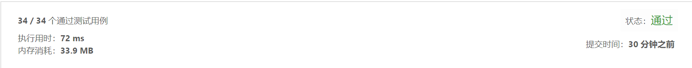

##  1282. 从上到下打印二叉树

>   请实现一个函数按照之字形顺序打印二叉树，即第一行按照从左到右的顺序打印，第二层按照从右到左的顺序打印，第三行再按照从左到右的顺序打印，其他行以此类推。


示例1:
```text
 给定二叉树: [3,9,20,null,null,15,7],
     3
    / \
   9  20
     /  \
    15   7
 返回其层次遍历结果：
 
 [
   [3],
   [20,9],
   [15,7]
 ]
```
- 解法1
  - 总体思路：
  
	  二叉树每个节点中加入一个层级参数，子节点层级为父节点层级+1
	   通过广度优先遍历的方式访问每个节点，根据层级把节点插入到对应层级的结果集中
	  
  - 具体思路如下：	
	   1.把根节点层级设置为0
	   2.自顶向下，自右向左把节点插入到栈中，
	   3.循环从栈中取出节点，获取当前节点的层级
	   4.如果当前层级在结果集中没有对应数组，则结果集中创建该数组
	   5.如果当前层级在结果集中有对应数组，如果层级为偶数，则在尾部插入，如果为奇数，则在首部插入
	  
	- 代码如下：
``` javascript
		/**
 * @param {TreeNode} root
 * @return {number[][]}
 */
var levelOrder = function(root) {
	if(!root) return []
    var res = []
	root.level = 0
	//初始化二叉树节点栈
	let stacks = [root]
	
	//循环出栈
	while(stacks.length > 0){
		//末尾节点出栈
		let node = stacks.pop()
		
		//获取当前层级
		let cur_lev = node.level
		
		//如果结果集中存在当前层级的数组，则根据层级的奇偶，插入数值
		if(res[cur_lev]){
			if(cur_lev % 2 === 0){
				//偶数则在末尾插入
				res[cur_lev].push(node.val)
			}else{
				//奇数则在首位插入
				res[cur_lev].unshift(node.val)
			}
		}else{//如果不存在当前层级的数组，则创建一个
			res[cur_lev] = [node.val]
		}
		
		//获取左节点和右节点
		let left = node.left
		let right = node.right
		
		//下一层级为当前层级加1
		let next_lev = cur_lev + 1
		
		//如果存在右子节点，则赋值右子节点层级，并插入到栈中
		if(right){
			right.level = next_lev
			stacks.push(right)
		}
		//如果存在左子节点，则赋值左子节点层级，并插入到栈中
		if(left){
			left.level = next_lev
			stacks.push(left)
		}
		return  res
	}
};
	
```

-测试结果


-算法分析
    - 时间复杂度: `O(n)`
    - 空间复杂度: `O(n)`

