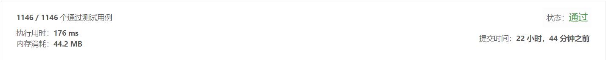

## 编辑距离

> 给定两个单词 word1 和 word2，计算出将 word1 转换成 word2 所使用的最少操作数 。
> 你可以对一个单词进行如下三种操作：
> 插入一个字符
> 删除一个字符
> 替换一个字符

示例1:
```text
输入: word1 = "horse", word2 = "ros"
输出: 3
解释: 
horse -> rorse (将 'h' 替换为 'r')
rorse -> rose (删除 'r')
rose -> ros (删除 'e')
```
示例2:
```text
输入: word1 = "intention", word2 = "execution"
输出: 5
解释: 
intention -> inention (删除 't')
inention -> enention (将 'i' 替换为 'e')
enention -> exention (将 'n' 替换为 'x')
exention -> exection (将 'n' 替换为 'c')
exection -> execution (插入 'u')
```

- 解法1
  - 解题思路    
    
    
  - 代码
``` javascript
		var minDistance = function(word1, word2) {
			var hash = {}
			
			var dp = function(m,n){
				
				if (m === -1) {
					return n+1
				}
				if (n === -1) {
					return m+1
				}
				var key = m + ',' + n
				if(hash[key]){
					return hash[key]//如果存在，返回缓冲值
				}
				var char1 = word1.charAt(m)
				var char2 = word2.charAt(n)
				if(char1 === char2){
					hash[key] = dp(m-1,n-1)//如果相等，比较下一个
				}
				if(char1 != char2){
					hash[key] = Math.min(dp(m,n-1) + 1,
						dp(m-1,n) + 1,dp(m-1,n-1) + 1)//进行插入，删除，替换，操作数加1，递归比较操作数，并获取最小操作数，将该最小值放到缓冲池中
				}
				return hash[key]
			}
			return dp(word1.length-1,word2.length-1)
		};
	
	
```
  
-测试结果

    
-算法分析
    - 时间复杂度: `O(n)`
    - 空间复杂度: `O(n)`

- 解法2**(非必须)**
  - 解题思路
    1. 应该这样做
    2. 然后这样做
    3. 接着这样做
    4. 最后得到答案
    
-代码
```javascript
    const result = 2;
    console.info(result);
```
    
-测试结果

       
-算法分析
    - 时间复杂度: `O(n)`
    - 空间复杂度: `O(n)`

-总结**(非必须)**
  > 遇到什么问题，或者其他什么需要多思考的，哪些部分需要学习的。