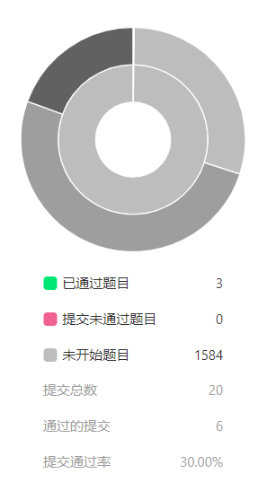

## [字符串](./week3-字符串)
 进度 

1. [leetCode#5-字符串](https://github.com/xianweics/algorithm-learning/blob/master/liyanbin/week3-%E5%AD%97%E7%AC%A6%E4%B8%B2/leetCode5-%E6%9C%80%E9%95%BF%E5%9B%9E%E6%96%87%E5%AD%97%E7%AC%A6%E4%B8%B2/%E6%9C%80%E9%95%BF%E5%9B%9E%E6%96%87%E5%AD%97%E7%AC%A6%E4%B8%B2.md)