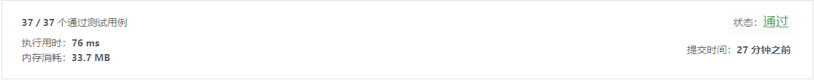

## 290. 单词规律

> 给定一种规律 pattern 和一个字符串 str ，判断 str 是否遵循相同的规律。
> 这里的 遵循 指完全匹配，例如， pattern 里的每个字母和字符串 str 中的每个非空单词之间存在着双向连接的对应规律。


示例1:
```text
输入: pattern = "abba", str = "dog cat cat dog"
输出: true
```
示例2:
```text
输入:pattern = "abba", str = "dog cat cat fish"
输出: false
```
示例 3:
```text
输入: pattern = "aaaa", str = "dog cat cat dog"
输出: false
```
- 解法1
  - 解题思路    
    总体思路：
	1.创建hash对象，这里用的object
	2.以pattern字符为key，以字符串项为value
	3.循环比较pattern和对应字符串位置的值是否相等，如果不等，则不匹配
	4.这里要注意一个不同的key 必须是不同的value，如果有相同的，则不匹配
    
  - 代码
``` javascript
		/**
		 * @param {string} pattern
		 * @param {string} str
		 * @return {boolean}
		 */
		var wordPattern = function(pattern, str) {
		    var obj = {}
		    var values = []
		    var strArr = str.split(' ')
			//如果长度不一致，则返回false
		    if(pattern.length !== strArr.length){
		        return false
		    }
		    for(var i = 0;i<pattern.length;i++){
				//如果存在，则进行匹配
		        if(obj[pattern[i]]){
		            if(obj[pattern[i]] !== strArr[i]){
		                return false
		            }
		        }else{
					//如果不存在，则将规律字符作为key值，字符串索引值作为value 存到object中
					//注意不同的key ，必须是不同的value
		            if(values.indexOf(strArr[i]) > -1){
		                return false
		            }
		            values.push(strArr[i])
		            obj[pattern[i]] = strArr[i]
		        }
		    }
		    return true
		};
	
```
  
-测试结果

    
-算法分析
    - 时间复杂度: `O(n2)`
    - 空间复杂度: `O(2n)`

- 解法2**(非必须)**
  - 解题思路
    另外看到网友将abba 和 dog cat cat dog都转换成数字0110比较的，思路清晰一点，不过在实现过程中，发现空间复杂度更大，可能自己代码写的不够好
	
刷题总体感受：
	1.刷题速度慢！很慢！太慢了！
	2.自己的思路比较繁琐，并且考虑不周到，所以实现过程中会出现很多问题，并且效率很低
总结：
	1.刷题之前必须先整理出一个清晰的思路再去实现，不能抱着尝试的心态去实现
	2.理解题意以后，可以通过草图、流程图、思维导图等方式梳理自己的思路
	3.不一定要专门分配时间去想解题思路，可以在走路、坐车、休息日常生活过程中去思考怎么解题
	
刷题的目标：
	1.提升自己解决问题的思路
	2.锻炼自己思考问题的全面性、有效性、和严谨性
