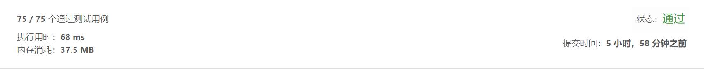

## 面试题 04.05. 合法二叉搜索树

> 实现一个函数，检查一棵二叉树是否为二叉搜索树。


示例1:
```text
输入:
    2
   / \
  1   3
输出: true
```
示例2:
```text
输入:
    5
   / \
  1   4
     / \
    3   6
输出: false
解释: 输入为: [5,1,4,null,null,3,6]。
     根节点的值为 5 ，但是其右子节点值为 4 。

```

- 解法1
  - 解题思路    
    整体思路
    本体的难度就是所有的左子树小于当前节点，所有的右子树大于当前节点
    这样会形成一个思路，在判断每个二叉树单元时，不再是只判断左子树节点、右子树节点和当前节点 值的大小
    而是要获取左子树节点的最大值，右子树节点的最小值进行比较
    对此，我们首先梳理一个最笨拙的思路：
    1.获取当前节点值
    2.获取左节点值，并循环访问左节点下面所有子节点的值，获取最大值
    3.获取右节点值，并循环访问右节点下面所有子节点的值，获取节点最小值
    4.当前节点值和左子节点最大值、右子节点最小值比较大小，验证是否合法
    5.左子节点和右子节点递归验证
    这个思路简单明了，但是问题太多，底层的左节点最大值和右节点最小值在递归的时候，会循环判断，
    
    参考思路：
    和上述思路类似，但是在获取左子节点最大值和右子节点最小值的时候，不再是判断子节点下面的所有节点，
    按照规则所有子节点下的右子节点即为最大值，右子节点最小值即所有子节点左子节点，这一点一直看不懂，
    后来重复整理思路发现这个也是应用了题目的规则，另外树节点规则比较上自底向上的，如果底面子节点符合规则，
    那么必定左子节点是最小值，右子节点是最大值，以此类推
    
  - 代码
``` javascript
		/**
		 * @param {TreeNode} root
		 * @return {boolean}
		 */
		var isValidBST = function(root) {
			if(root === null) return true
			//默认左节点为最大节点，右节点为最小节点
			let maxLeft = root.left,minRight = root.right
			
			//递归获取左节点及其所有子节点最大节点，根据题目规则，子节点下的右节点即为最大节点值
			while(maxLeft && maxLeft.right){
				maxLeft = maxLeft.right
			}
			
			//递归获取右节点及其所有子节点最小节点，根据题目规则，子节点下的左节点即为最小节点值
			while(minRight && minRight.left){
				minRight = minRight.left
			}
			
			//左右子节点为空或者子节点值符合规则及为真
			res = (root.left === null || maxLeft.val < root.val) && (root.right === null || minRight.val > root.val)
			//子节点和当前节点都符合规则，则为真
			return res && isValidBST(root.left) && isValidBST(root.right)
		};
		
		function TreeNode(val) {
		     this.val = val;
		     this.left = this.right = null;
		}
	
```
  
-测试结果

   
