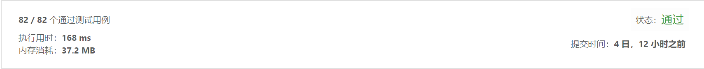

## 33. 搜索旋转排序数组

> 假设按照升序排序的数组在预先未知的某个点上进行了旋转。
> ( 例如，数组 [0,1,2,4,5,6,7] 可能变为 [4,5,6,7,0,1,2] )。
> 搜索一个给定的目标值，如果数组中存在这个目标值，则返回它的索引，否则返回 -1 。
> 你可以假设数组中不存在重复的元素。
> 你的算法时间复杂度必须是 O(log n) 级别。


示例1:
```text
输入: nums = [4,5,6,7,0,1,2], target = 0
输出: 4
```
示例2:
```text
输入: nums = [4,5,6,7,0,1,2], target = 3
输出: -1
```

- 解法1
  - 总体思路：逆向思维，假设每天的最低运载能力为m，验证是否合法
  - 具体实现思路如下：
	1.获取最低运载量的最小值，最小值为 平均运载量和包裹最大运载量的最大值
	2.从最低运载量开始，自增递归验证运载量是否为所有包裹送达的船的最低运载能力。

  - 代码如下：
``` javascript
		/**
		 * @param {TreeNode} root
		 * @return {boolean}
		 */
		var shipWithinDays = function(weights, D) {
			let dayMinWdt = 0,maxWidget = 0
			for(let i = 0;i<weights.length;i++){
				maxWidget = Math.max(maxWidget,weights[i])
				dayMinWdt += weights[i]
			}
			//每日最低运载量取平均运载量和单个物品最大运载量的 最大值
			dayMinWdt = Math.max(Math.ceil(dayMinWdt/D),maxWidget) 
			
			let verifyMaxWeight = ()=>{
				let dayWidget = 0	//每天最多运载的重量
				let dayNum = 1 //需要运载的天数,考虑到最后一天的运载量无法计算到，故初始值需要设置为1
				for(let i = 0;i<weights.length;){
					//如果单个物品的运载量大于每日最低运载量，则将该值设置为最低运载量，并重新校验
					dayWidget += weights[i]
					//如果大于当前最低运载量，则：
					//1.把前一个包裹放到后一天；
					//2.后一天的运载量置0；
					//3.重新开始计算下一天的运载量
					if(dayWidget > dayMinWdt){ 
						dayWidget = 0
						dayNum ++
						continue
					}
					//如果天数大于指定天数，每日最低运载量+1 重新校验
					if(dayNum > D){
						dayMinWdt += 1
						verifyMaxWeight()
						break
					}
					i++
				}
			}
			verifyMaxWeight()
			return dayMinWdt
		};
	
```
  
-测试结果


- 解法2
  - 总体思路：同解法1，只是用了二分法进行了优化
  - 具体实现思路如下：
	1.获取最低运载量的最小值，最小值为 平均运载量和包裹最大运载量的最大值
	2.取最小值和最大值的中间值，然后不断缩小范围进行计算，实现过程很绕，但是只要把思路梳理清楚，其实就是多中简单思路的组合

  - 代码如下：
``` javascript
		/**
		 * @param {TreeNode} root
		 * @return {boolean}
		 */
		var shipWithinDays1 = function(weights, D) {
			let right = 0,maxWidget = 0,len = weights.length
			for(let i = 0;i<len;i++){
				maxWidget = Math.max(maxWidget,weights[i])
				right += weights[i]
			}
			//每日最低运载量取平均运载量和单个物品最大运载量的 最大值
			let left = Math.max(Math.ceil(right/D),maxWidget)
			
			while(left < right){
				let mid = (left + right) >> 1 //即(left + right)/2¹
				verifyMaxWeight(mid,D)?(left = mid + 1):(right = mid)
			}
			return left
			
			function verifyMaxWeight(mid,day){
				let sum = 0
				for(let i = 0;i<len;){
					sum += weights[i]
					if(sum > mid){
						day--;
						sum = 0
						continue;
					}
					i++
				}
				return day < 1
			}
		}
	
```
  
-测试结果

   
