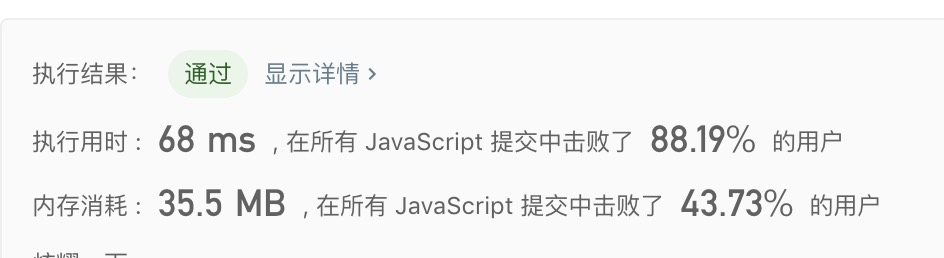

## 接雨水

> 给定 n 个非负整数表示每个宽度为 1 的柱子的高度图，计算按此排列的柱子，下雨之后能接多少雨水。<br/>


示例1:
```text
输入: [0,1,0,2,1,0,1,3,2,1,2,1]
输出: 6
```

- 解法
  - 解题思路
    1. 遍历整个数组
      1. 如果找下一个值 `height[curIndex]` 大于当前的值 `curValue`，取出 `arr` 的值计算面积；
      2. 如果没找到，则遍历剩下的数组
        1. 如果找到剩下数组中存在一个 `height[possibleIndex]`，则跳出剩下数组的查找，取出 `arr` 的值计算面积；
        2. 否则将值存在 `arr` 中；
        3. 在遍历的同时，取出剩下数组中最大的值 `nextMaxValue` 以及坐标 `possibleIndex`；
        4. 如果剩下的数组没有存在比当前的值 `curValue` 大的值，那么就根据 `nextMaxValue` 以及 `possibleIndex` 取出 `height` 中部分值计算面积；
    2. `nextMaxValue` 以及 `nextMaxIndex` 主要是做缓存用，减少重复查找；
    3. 总的来说，使用双指针处理当前值与下一个值，进行对比，然后在动态改变那两个指针；
    
  - 代码
    ```javascript
    /**
     * @param {number[]} height
     * @return {number}
     */
    var trap = function(height) {
      let curValue = 0; // 记录当前坐标下的值
      let count = 0;
      let arr = [];
      const hlength = height.length;
    
      // curIndex: 记录当前值的下标，为 `curValue` 的下标；
      for(let curIndex = 0; curIndex < hlength; curIndex++){
        if(height[curIndex] >= curValue){
          while(arr.length > 0){
            count = curValue - arr.pop() + count;
          }
          curValue = height[curIndex];
        }else{
          let possibleIndex = curIndex; // 记录该坐标的值下大于等于当前值
          let nextMaxIndex = 0; // 为 nextMaxValue 的下标
          let nextMaxValue = 0; // 记录比当前值小，但是剩下元素中最大的值
          while(possibleIndex < hlength){
            const nextItem = height[possibleIndex];
            if(nextMaxValue <= nextItem){
              nextMaxValue = nextItem;
              nextMaxIndex = possibleIndex;
            }
            if(nextItem >= curValue){
              curIndex = possibleIndex - 1;
              break;
            }else{
              arr.push(nextItem);
            }
            possibleIndex++;
          }
          if(possibleIndex === hlength){
            curValue = nextMaxValue;
            arr = height.slice(curIndex, nextMaxIndex);
            curIndex = nextMaxIndex - 1;
          }
        }
      }
      return count;
    };
    ```
  
   - 测试结果
     
    
  - 算法分析
    - 时间复杂度: `O(n^2)`
    - 空间复杂度: `O(n)`

- 总结
  > 只要想到解题思路，题目本身难度不大，但是细节处理方面容易出错，比较麻烦点。