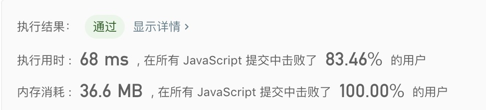

## 面试题63. 股票的最大利润

> 假设把某股票的价格按照时间先后顺序存储在数组中，请问买卖该股票一次可能获得的最大利润是多少？

示例1:
```text
输入: [7,1,5,3,6,4]
输出: 5
解释: 在第 2 天（股票价格 = 1）的时候买入，在第 5 天（股票价格 = 6）的时候卖出，最大利润 = 6-1 = 5 。
     注意利润不能是 7-1 = 6, 因为卖出价格需要大于买入价格。
```

示例2:
```text
输入: [7,6,4,3,1]
输出: 0
解释: 在这种情况下, 没有交易完成, 所以最大利润为 0。
```


- 解法
  - 解题思路
    1. 需要获得买卖一次的最大值，则只要算出每次交易所得到的最大利润，则最后一次交易一定是最大值。
    2. 例如：`prices = [1, 2, 3]`, 则 `maxPrices = [0, 1, 2]`。如果`prices = [1, 2, 3, 2]`, 则 `maxPrices = [0, 1, 2, 2]`。
    3. 通过例子得出：完成一次买卖操作要的得到最大利润，要嘛是上一个交易利润的最大值（即上次买卖完成），要嘛就是当前卖出价格 `-` 过去买入的最小值。
    4. 所以可以得出转换方程式：`d[i] = Max(d[i - 1], prices[i] - Min(prices[0],... prices[i - 1]));`
    5. 例如 `prices = [7,1,5,3,6,4]`:
        - `d[0] = 1; d[1] = 0;` 要买入并且卖出才能完成交易
        - `d[1] = Max(d[0], prices[1] - prices[0]) = 0`
        - `d[2] = Max(d[1], prices[1] - Min(prices[0], prices[1])) = 4`
        - `d[3] = 4；d[4] = 5; d[6] = 5`
        
  - 代码
    ```javascript
    /**
     * @param {number[]} height
     * @return {number}
     */
    /**
     * @param {number[]} prices
     * @return {number}
     */
    var maxProfit = function(prices) {
     if(prices.length < 2) return 0;
      
      const d = [0];
      let min = prices[0];
      for(let i = 1; i < prices.length; i++){
        if(prices[i] <= min){
          min = prices[i];
        }
        d[i] = Math.max(d[i - 1], prices[i] - min);
      }
      return d[prices.length - 1];
    };
    ```
  
   - 测试结果
     
    
  - 算法分析
    - 时间复杂度: `O(n^2)`
    - 空间复杂度: `O(n)`

- 总结
  > 做了5道dp相关的题目，如果单纯的dp问题，并且有思路，解决起来还是相对容易。但是如果涉及到跟dp结合的其他题型，例如跟数学、跟回溯结合就没思路，容易陷入死循环。<br/>
  > dp思想算是理清楚了，但是复杂的dp还是需要多做题在学习。