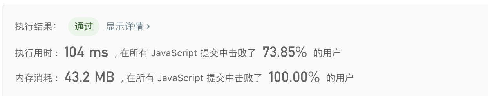

## 1249. 移除无效的括号

> 给你一个由 '('、')' 和小写字母组成的字符串 s。<br/>
> 你需要从字符串中删除最少数目的 '(' 或者 ')' （可以删除任意位置的括号)，使得剩下的「括号字符串」有效。<br/>
> 请返回任意一个合法字符串。<br/>
> 有效「括号字符串」应当符合以下 任意一条 要求：<br/>
> 空字符串或只包含小写字母的字符串<br/>
> 可以被写作 AB（A 连接 B）的字符串，其中 A 和 B 都是有效「括号字符串」<br/>
> 可以被写作 (A) 的字符串，其中 A 是一个有效的「括号字符串」

示例1:
```text
输入：s = "lee(t(c)o)de)"
输出："lee(t(c)o)de"
解释："lee(t(co)de)" , "lee(t(c)ode)" 也是一个可行答案。
```

示例2:
```text
输入：s = "a)b(c)d"
输出："ab(c)d"
```

示例3:
```text
输入：s = "))(("
输出：""
解释：空字符串也是有效的
```

示例4:
```text
输入：s = "(a(b(c)d)"
输出："a(b(c)d)"
```


- 解法
  - 解题思路： 
    1. 使用2个数组 `symbols` `indexes` 分别存符号以及符号的下标
    2. 遍历字符串，通过栈进行符号的匹配，如果找到匹配的符号则移除数组 `symbols` `indexes` 的符号以及下标，否则添加
    3. 此时我们得到 `symbols` 就是我们需要移除的符号
    
  - 代码
    ```javascript
    /**
     * @param {string} s
     * @return {string}
     */
    /**
     * @param {string} s
     * @return {string}
     */
    const minRemoveToMakeValid = function(s) {
      const symbols = [];
      const indexes = [];
      for(let i = 0; i < s.length; i++){
        if(s[i] === '('){
          symbols.push(s[i]);
          indexes.push(i);
        }else if(s[i] === ')'){
          if(symbols.length > 0 && symbols[symbols.length - 1] === '('){
            symbols.pop();
            indexes.pop();
          }else{
            symbols.push(s[i]);
            indexes.push(i);
          }
        }
      }
      while(indexes.length > 0){
        const index = indexes.pop();
        s = s.substr(0, index) + ' ' + s.substr(index + 1);
      }
      return s.replace(/\s+/g, '');
    };
    ```
  
   - 测试结果
     
    
  - 算法分析
    - 时间复杂度: `O(n) ~ O(n^2)`
    - 空间复杂度: `O(n)`

- 总结
  > 看了好几道题，发觉字符串跟栈结合以及双指针结合比较多，另外由于字符串本身是不可赋值，所以不能直接改变字符串某个值；<br/>
  > 一般通过转数组，或者通过 `slice` 等字符串切割方法进行赋值