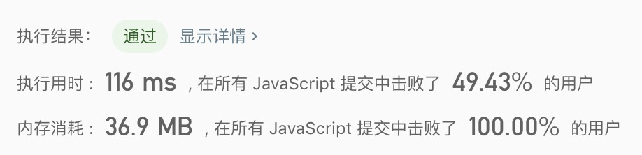

## 437. 路径总和 III

> 给定一个二叉树，它的每个结点都存放着一个整数值。<br/>
> 找出路径和等于给定数值的路径总数。<br/>
> 路径不需要从根节点开始，也不需要在叶子节点结束，但是路径方向必须是向下的（只能从父节点到子节点）。
  
示例1:
```text
root = [10,5,-3,3,2,null,11,3,-2,null,1], sum = 8

      10
     /  \
    5   -3
   / \    \
  3   2   11
 / \   \
3  -2   1

返回 3。和等于 8 的路径有:

1.  5 -> 3
2.  5 -> 2 -> 1
3.  -3 -> 11
```

- 解法
  - 解题思路： 
    1. 该问题需要分2部处理，第一步是从根开始查找到尾部，找到路径总长度为 `sum`的值；第二部是把树从根到叶子再查找第一步所需要的总长度。
    2. 第一个问题：
      1. 首先通过从树的根深度遍历整棵树，在遍历的同时通过 `sum` 去递减每次的计算结果，
      2. 如果当前节点跟最后递减的 `sum` 一样，表示找到符合条件的值。
    3. 第二个问题：需要从根的下一个节点查找，即 `root.left` 和 `root.right`，则只需要再遍历一次根节点，让子节点去执行第一步的逻辑就行。
    
  - 代码
    ```javascript
    /**
     * Definition for a binary tree node.
     * function TreeNode(val) {
     *     this.val = val;
     *     this.left = this.right = null;
     * }
     */
    /**
     * @param {TreeNode} root
     * @param {number} sum
     * @return {number}
     */
    const pathSum = function(root, sum) {
      let count = 0;
      const checkVal = (root, sum) => {
        if(!root) return;
        if(root.val === sum){
          count++;
        }
        const rest = sum - root.val;
        checkVal(root.left, rest);
        checkVal(root.right, rest);
      };
      
      const treeLoop = (root, sum) => {
        if(!root) return;
        checkVal(root, sum);
        treeLoop(root.left, sum);
        treeLoop(root.right, sum);
      };
      
      treeLoop(root, sum);
      return count;
    };
    ```
  
   - 测试结果
     
    
  - 算法分析
    - 时间复杂度: `O(n^2)`
    - 空间复杂度: `O(1)`

- 总结
  > 主要是学习树的查询为主的题型。树的问题比较绕，大部分都是递归问题。递归重点是找递归点，以及递归结束点。<br/>
  > 树的删除，创建等问题，还需要花时间研究。