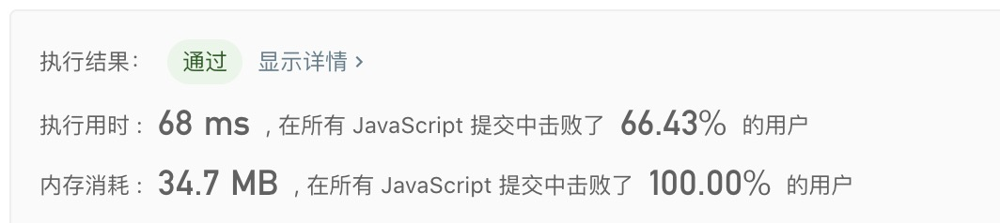

## 151. 翻转字符串里的单词

> 给定一个字符串，逐个翻转字符串中的每个单词。

示例1:
```text
输入: "the sky is blue"
输出: "blue is sky the"
```

示例2:
```text
输入: "  hello world!  "
输出: "world! hello"
解释: 输入字符串可以在前面或者后面包含多余的空格，但是反转后的字符不能包括。
```

示例3:
```text
输入: "a good   example"
输出: "example good a"
解释: 如果两个单词间有多余的空格，将反转后单词间的空格减少到只含一个。
```

- 解法
  - 解题思路： 清晰明了
    1. 转数组
    2. 翻转
    3. 合并
    
  - 代码
    ```javascript
    /**
     * @param {string} s
     * @return {string}
     */
    var reverseWords = function(s) {
      return s.trim().split(/\s+/).reverse().join(' ');
    };
    ```
  
   - 测试结果
     
    
  - 算法分析
    - 时间复杂度: `O(n)`
    - 空间复杂度: `O(1)`

- 总结
  > 做4道题都是把字符串转数组，然后遍历数组中值进行操作。感觉更多是操作数组。