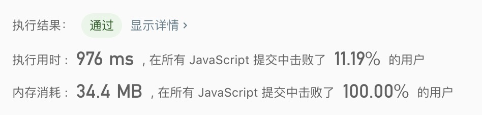
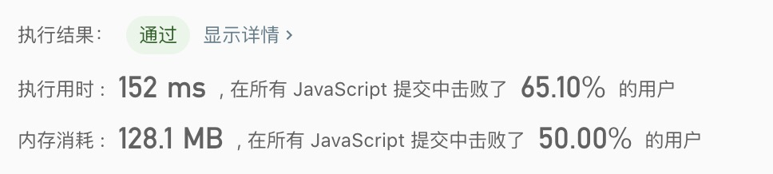

## 204. 计数质数

> 统计所有小于非负整数 n 的质数的数量。

示例1:
```text
输入: 10
输出: 4
解释: 小于 10 的质数一共有 4 个, 它们是 2, 3, 5, 7 。
```

- 解法1
  - 解题思路： 暴力破解
    
  - 代码
    ```javascript
    /**
     * @param {number} n
     * @return {number}
     */
    var countPrimes = function(n) {
      if(n <= 2) return 0;
      let count = 0;
      for(let i = 2; i < n; i++){
        let isPrimes = true;
        const smaller = Math.sqrt(i);
        for(let j = 2; j <= smaller; j++){
          if(i % j === 0){
            isPrimes = false;
            break;
          }
        }
        if(isPrimes){
          count++;
        }
      }
      return count;
    };
    ```
  
   - 测试结果
     
    
  - 算法分析
    - 时间复杂度: `O(nlogn)`
    - 空间复杂度: `O(1)`


- 解法2
  - 解题思路： 厄拉多塞筛选算法
    
  - 代码
    ```javascript
    /**
     * @param {number} n
     * @return {number}
     */
    var countPrimes = function(n) {
      if(n <= 2) return 0;
      let count = 0;
      for(let i = 2; i < n; i++){
        let isPrimes = true;
        const smaller = Math.sqrt(i);
        for(let j = 2; j <= smaller; j++){
          if(i % j === 0){
            isPrimes = false;
            break;
          }
        }
        if(isPrimes){
          count++;
        }
      }
      return count;
    };
    ```
  
   - 测试结果
     
    
  - 算法分析
    - 时间复杂度: `O(nloglogn)`
    - 空间复杂度: `O(n)`
    
- 总结
  > 哈希表涉及到滑动算法，厄拉多塞筛选算法等，这些算法都很巧妙解决时间复杂度过高的问题。滑动算法还不是很清楚，还需要花时间研究。